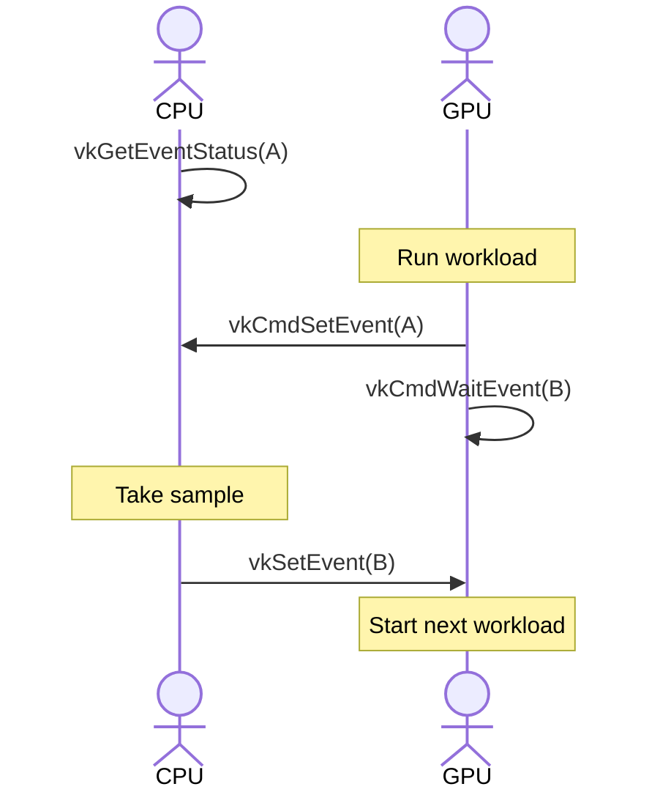

# Layer: GPU Profile - Developer Documentation

This layer is used to profile Arm GPUs, providing API correlated performance
data. This page provides documentation for developers working on creating and
maintaining the layer.

## Measuring performance

Arm GPUs can run multiple workloads in parallel, if the application pipeline
barriers allow it. This is good for overall frame performance, but it makes
a mess of profiling data!

## Measuring performance

Arm GPUs can run multiple workloads in parallel, if the application pipeline
barriers allow it. This is good for overall frame performance, but it makes
profiling data messy due to cross-talk between unrelated workloads.

For profiling we therefore inject serialization points between workloads to
ensure that data corresponds to a single workload. Note that we can only
serialize within our own application process, so data could still be perturbed
by other processes using the GPU.

### Sampling performance counters

This layer will sample performance counters between each workload but, because
sampling is a CPU-side operation, it must trap back to the CPU to make the
counter sample. The correct way to implement this in Vulkan is to split the
application command buffer into multiple command buffers, each containing a
single workload. However, rewriting the command stream like this is expensive
in terms of CPU overhead caused by the state tracking.

Instead we rely on an undocumented extension supported by Arm GPUs which
allows the CPU to set/wait on events in a submitted but not complete command
buffer. The layer injects a `vkCmdSetEvent(A)` and `vkCmdWaitEvent(B)` pair
between each workload, and then has the reverse `vkWaitEvent(A)` and
`vkSetEvent(B)` pair on the CPU side. The counter sample can be inserted
in between the two CPU-side operations. Note that there is no blocking wait on
an event for the CPU, so `vkWaitEvent()` is really a polling loop around
`vkGetEventStatus()`.



### Performance implications

Serializing workloads usually means that individual workloads will run with
lower completion latency, because they are no longer contending for resources.
However, loss of pipelining and overlap means that overall frame latency will
increase compared to a well overlapped scenario.

In addition, serializing workloads and then trapping back to the CPU to
sample performance counters will cause the GPU to go idle waiting for the CPU
to complete the counter sample. This makes the GPU appear underutilized to the
system DVFS governor, which may subsequently decide to reduce the GPU clock
frequency. On pre-production devices we recommend locking CPU, GPU and memory
clock frequencies to avoid this problem.

```mermaid
---
displayMode: compact
---
gantt
    dateFormat x
    axisFormat %Lms
    section CPU
    Sample: a1, 0, 2ms
    Sample: a2, after w1, 2ms
    section GPU
    Workload 1:w1, after a1, 10ms
    Workload 2:w2, after a2, 10ms
```



## Software architecture

The basic architecture for this layer is an extension of the timeline layer,
using a layer command stream (LCS) recorded alongside each command buffer to
define the software operations that the layer needs to perform at submit time.

Because counter sampling is handled synchronously on the CPU when a frame is
being profiled, the layer handles each `vkQueueSubmit` and its associated
counter samples synchronously at submit time before returning to the
application. When sampling the layer retains the layer lock when calling into
the driver, ensuring that only one thread at a time can process a submit that
makes counter samples.

## Event handling

To implement this functionality, the layer allocates two `VkEvent` objects to
support the CPU<->GPU handover for counter sampling. These events are reset and
reused for all counter samples to avoid managing many different events.

```c
CPU                       GPU
===                       ===
                          // Workload 1
                          vkCmdSetEvent(A)
// Spin test until set
vkGetEventStatus(A)
vkResetEvent(A)

// Sample counters

vSetEvent(B)
                          // Block until set
                          vkCmdWaitEvent(B)
                          vkCmdResetEvent(B)

                          // Workload 2
```

Due to an errata in the interaction between the counter sampling and power
management in some older kernel driver versions, Arm GPUs with the CSF frontend
and a driver older than r54p0 need a sleep after successfully waiting on
event A and before sampling any counters.

Initial investigations seem to show that the shortest reliable sleep is 3ms, so
this is quite a high overhead for applications with many workloads and
therefore should be enabled conditionally only for CSF GPUs with a driver older
than r54p0.

- - -
_Copyright © 2025, Arm Limited and contributors._
