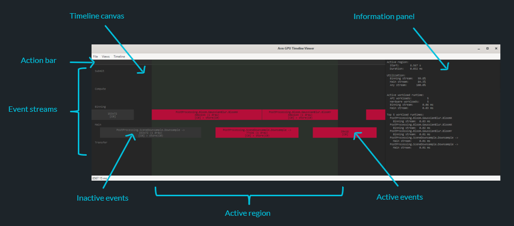

# Layer: GPU Timeline

This layer is used with Arm GPU tooling that show the scheduling of workloads
on to the GPU hardware queues. The layer provides additional semantic
annotation, extending the scheduling data from the Android Perfetto render
stages telemetry with useful API-aware context.



Visualizations generated using this tooling show the execution of each
workload event, grouping events by the hardware scheduling stream used. These
streams might run in parallel on the GPU, and the visualization shows the
level of parallelization achieved.

## What devices are supported?

The first Arm GPU driver integration with Android Perfetto render stages
tracing is in the r47p0 driver version. However, associating metadata from
this layer with Perfetto trace events requires a newer r51p0 or later driver
version, although some hardware vendors have backported this functionality
to an r49p1-based driver.

## How do I use the layer?

### Prerequisites

Device setup steps:

* Ensure your Android device is in developer mode, with `adb` support enabled
  in developer settings.
* Ensure the Android device is connected to your development workstation, and
  visible to `adb` with an authorized debug connection.

Application setup steps:

* Build a debuggable build of your application and install it on the Android
  device.

Tooling setup steps

* Install the Android platform tools and ensure `adb` is on your `PATH`
  environment variable.
* Install the Android NDK and set the `ANDROID_NDK_HOME` environment variable
  to its installation path.
* The viewer uses Python 3.10 or newer. See https://www.python.org.
* The viewer uses PyGTK, and requires the native GTK3 libraries and PyGTK to
  be installed. See https://www.gtk.org/docs/installations.
* Python dependencies might be installed using the Python 3 `pip` package
  manager.

```
python3 -m pip install protobuf pygobject
```

### Layer build

Build the Timeline layer for Android using the provided build script, or using
equivalent manual commands, from the `layer_gpu_timeline` directory. For full
instructions see the _Build an Android layer_ section in the
[Build documentation](../docs/building.md).

### Layer run

You record a timeline by using the Android helper utility found in the root
directory to configure the layer and manage the capture process. You must
enable the timeline layer, and the base name of the output files that will
contain the final timeline data.

```sh
python3 lgl_android_install.py --layer layer_gpu_timeline --timeline <out>
```

The timeline data files will be saved as `<out>.perfetto` and `<out>.metadata`.
If you want to use different file names for each, you might alternatively
specify a full file path for each file using `--timeline-perfetto` and
`--timeline-metadata`.

The Android helper utility contains many other options for configuring the
application under test and the capture process. For full instructions see the
[Running on Android documentation](../docs/running_android.md).

## Timeline visualization

This project includes an experimental Python viewer which parses and
visualizes the data in the two data files captured earlier.

Run the following command to start the tool:

```sh
python3 lgl_mali_timeline_viewer.py <out.perfetto> <out.meta>
```

Once the tool has loaded the data select "Views > Timeline" in the menu bar to
open the visualization. **Note:** The Python tool is relatively slow at parsing
the trace files, but once loaded the viewer is relatively fast.

### Event content

Event boxes show:

* The user debug label associated with the workload.
* The dimensions of the workload.
* The number of draw calls in a render pass.
* The color attachments with loadOp and storeOp usage highlighted.

### Controls

The viewer consists of two main areas. The Timeline canvas that shows the
events, and the Information panel that shows a summary of the current active
events and time range.

Navigation uses the mouse:

* Zoom: Mouse wheel.
* Pan: Middle mouse button, hold and drag.

Selecting a set of active events:

* Select events:
  * Left click/drag to create a new selection
  * <kbd>Ctrl</kbd> + Left click/drag to add to existing selection
  * <kbd>Shift</kbd> + Left click/drag to remove from existing selection
* Select events by group:
  * Right click on an event, and use context menu to create a new selection
  * Group options available include:
    * By frame
    * By Vulkan queue submit
    * By Vulkan command
    * By Vulkan queue
* Clear selection:
  * Right click on a blank space on the canvas, and use context menu

Selecting an active time range:

* Set start time:
  * Left click on the action bar
* Set end time:
  * Right click on the action bar
* Clear time:
  * Right click on a blank space on the canvas, and use context menu

## What workloads are supported?

The Arm GPU scheduler event trace might generate timing events for each
atomically schedulable workload submitted to the GPU scheduler.

Most workloads submitted to a Vulkan queue by the application are a single
schedulable entity, for example a compute dispatch or transfer is a single
workload.

The exception to this is the render pass workload. Arm GPUs are tile-based, so
each group of merged subpasses from a render pass is processed as two
schedulable phases. The first phase - the vertex or binning phase - determines
which primitives contribute to which screen-space tiles. The second phase - the
fragment or main phase - reads the binning information and completes fragment
shading tile-by-tile.

This layer tracks the following workloads:

* Render passes
* Compute dispatches
* Trace rays dispatches
* Transfers to a buffer
* Transfers to an image

## Tracking workloads

The latest Arm driver integration with the Perfetto profiler propagates
application debug labels into the GPU Render Stages scheduler events. The debug
labels are the label stack created using either of these Vulkan methods:

* `vkCmdBegin/EndDebugUtilsLabelEXT()`
* `vkCmdDebugMarkerBegin/EndEXT()`

This layer utilizes this mechanism to wrap each submitted workload in a command
buffer with a unique `tagID` which identifies that recorded workload. A
metadata side-channel provides the metadata for each workload, annotating each
metadata record with the matching `tagID` to allow them to be cross-referenced
later.

### Limitation: Indirect dispatches and trace rays

The current implementation captures the metadata parameters when the command
buffer is recorded. The layer does not currently support asynchronous capture
of indirect parameter buffers. Indirect dispatch and trace rays are still
captured and reported, but with unknown workload dimensions.

### Limitation: Compute dispatch sizes

The current implementation reports the size of a compute workload as the
number of work groups, because this is the parameter used by the API. We
eventually want to report this as the number of work items, but the parsing of
the SPIR-V and pipeline parameters has not yet been implemented.

### Limitation: Dynamic render passes split over multiple command buffers

The label containing the `tagID` is recorded into the application command
buffer when the command buffer is recorded. The workload-to-metadata mapping
requires that every use of a `tagID` has the same properties, or we will be
unable to associate the correct metadata with its matching workload.

Content that splits a render pass over multiple command buffers that are not
one-time-submit violates this requirement. Multiple submits of a render pass
with a single `tagID` might have different numbers of draw calls, depending on
the number of draws that occur in the later command buffers that resume the
render pass. When the layer detects suspended render pass in a multi-submit
command buffer, it will still capture and report the workload, but with an
unknown draw call count.

## Developer documentation

This page covers using the layer as a tool for application development. For
documentation about developing the layer itself, please refer to the
[developer documentation](./docs/developer-docs.md).

- - -

_Copyright © 2024-2025, Arm Limited and contributors._
